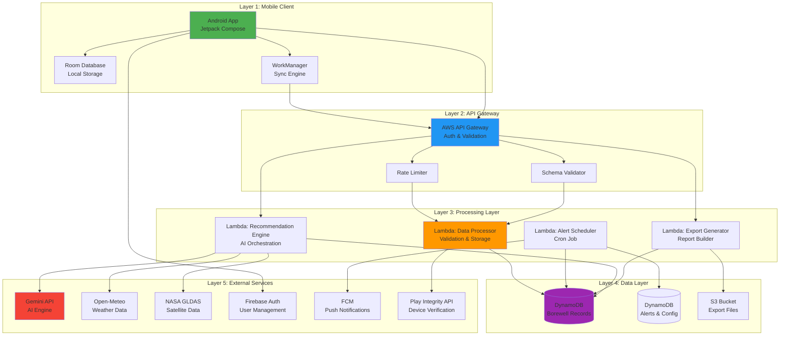

# Design Document: Anthar-Jala Watch

## Overview

Anthar-Jala Watch is a production-grade groundwater monitoring platform implementing a privacy-first, offline-capable architecture for rural water resource management. The system enables crowdsourced borewell data collection through Android devices, provides real-time visualization of water stress patterns, delivers predictive alerts for declining groundwater levels, and generates AI-powered recharge recommendations using multi-source environmental data.

### System Goals

1. **Privacy Protection**: Implement geohash-based location obfuscation to protect user privacy while maintaining data utility
2. **Offline Resilience**: Enable data collection in areas with intermittent connectivity through local storage and intelligent synchronization
3. **Security Hardening**: Implement multi-layer security including device integrity verification, anti-spoofing controls, and comprehensive input validation
4. **Actionable Intelligence**: Provide AI-powered recommendations based on satellite data, weather patterns, and local measurements
5. **Scalability**: Support thousands of concurrent users and millions of data points through serverless architecture

### Key Design Decisions

**Architecture Pattern**: 5-layer serverless architecture separating concerns across mobile client, API gateway, processing layer, storage, and external integrations. This provides independent scaling, clear security boundaries, and simplified deployment.

**Privacy Strategy**: Geohash precision level 6 (1.2km x 0.6km resolution) balances privacy protection with data utility for regional analysis. Raw GPS coordinates are never stored or transmitted.

**Offline-First Approach**: Room database with WorkManager-based synchronization ensures data collection continues during network outages, critical for rural deployment scenarios.

**Security Model**: Defense-in-depth with Firebase authentication, Play Integrity verification, rate limiting, IP-based anti-spoofing, and comprehensive input validation at multiple layers.

**AI Integration**: Gemini API with structured prompts incorporating borewell measurements, weather data (Open-Meteo), and satellite data (NASA GLDAS) for context-aware recommendations.

## Architecture

### System Architecture Diagram



### Component Interaction Flow

**Data Submission Flow**:
1. User enters borewell data in Android App
2. App converts GPS to geohash, validates inputs
3. If offline: Store in Room Database with sync pending flag
4. If online: Submit to API Gateway with Firebase JWT and Play Integrity token
5. API Gateway validates authentication, rate limits, and schema
6. Lambda Processor validates geohash, timestamp, performs anti-spoofing check
7. Lambda stores record in DynamoDB, computes water stress level
8. Response returned to app, sync status updated

**Alert Generation Flow**:
1. EventBridge triggers Alert Scheduler Lambda daily
2. Lambda queries DynamoDB for all geohash regions with recent data
3. For each region: Compare 7-day average vs 23-day average depth
4. If drop exceeds 15%: Create alert record, identify affected users
5. Send alert payload to FCM with region details and deep link
6. FCM delivers push notifications to user devices
7. App displays notification with heatmap navigation

**Recommendation Generation Flow**:
1. User requests recommendations for a region
2. Lambda fetches recent borewell data from DynamoDB
3. Lambda queries Open-Meteo for 90-day rainfall data
4. Lambda queries NASA GLDAS for soil moisture and groundwater storage
5. Lambda constructs structured prompt with all data sources
6. Gemini API generates recommendations with techniques, costs, steps
7. Lambda validates and structures response
8. Lambda stores recommendation in DynamoDB
9. App displays formatted recommendations with visual hierarchy

## Components and Interfaces

### Android Application Components

#### Data Collection Module
**Responsibility**: Capture and validate borewell measurements with privacy protection

**Key Classes**:
- `BorewellInputViewModel`: Manages input state, validation, and submission logic
- `GeohashConverter`: Converts GPS coordinates to geohash precision 6
- `InputValidator`: Validates depth (0-500m) and yield (0-50000 L/h) ranges
- `LocationService`: Retrieves GPS coordinates with permission handling

**Interfaces**:
```kotlin
interface BorewellRepository {
    suspend fun submitBorewell(depth: Double, yield: Double, geohash: String): Result<String>
    suspend fun saveBorewellOffline(record: BorewellRecord): Long
}

data class BorewellRecord(
    val id: Long = 0,
    val depth: Double,
    val yield: Double,
    val geohash: String,
    val timestamp: Long,
    val syncPending: Boolean = false
)
```

#### Offline Sync Module
**Responsibility**: Manage offline storage and automatic synchronization

**Key Classes**:
- `SyncWorker`: WorkManager worker implementing exponential backoff
- `BorewellDao`: Room DAO for local database operations
- `SyncStatusTracker`: Monitors sync progress and failures

**Interfaces**:
```kotlin
interface SyncManager {
    fun scheduleSyncWork()
    fun getSyncStatus(): Flow<SyncStatus>
    suspend fun forceSyncNow(): Result<Int>
}

data class SyncStatus(
    val pendingCount: Int,
    val lastSyncTime: Long?,
    val isSyncing: Boolean,
    val failedAttempts: Int
)
```

#### Heatmap Visualization Module
**Responsibility**: Display water stress levels on Google Maps

**Key Classes**:
- `HeatmapViewModel`: Manages heatmap data fetching and state
- `WaterStressCalculator`: Computes stress levels using formula: `stress = (1 - normalized_depth) * 0.6 + (1 - normalized_yield) * 0.4`
- `TileRenderer`: Implements tile-based rendering for large datasets
- `HeatmapCache`: Caches tiles for 30 minutes

**Interfaces**:
```kotlin
interface HeatmapDataSource {
    suspend fun fetchAggregatedData(bounds: LatLngBounds): Result<List<GeohashCluster>>
    suspend fun refreshData()
}

data class GeohashCluster(
    val geohash: String,
    val avgDepth: Double,
    val avgYield: Double,
    val sampleCount: Int,
    val waterStressLevel: Double
)
```

#### Authentication Module
**Responsibility**: Handle Firebase phone authentication with OTP

**Key Classes**:
- `AuthViewModel`: Manages authentication flow state
- `FirebaseAuthManager`: Wraps Firebase Authentication SDK
- `TokenManager`: Securely stores JWT in Android Keystore with auto-refresh

**Interfaces**:
```kotlin
interface AuthRepository {
    suspend fun sendOtp(phoneNumber: String): Result<String>
    suspend fun verifyOtp(verificationId: String, code: String): Result<User>
    suspend fun getAuthToken(): String?
    suspend fun logout()
}
```

### API Gateway Layer

#### Security Configuration
- **Authentication**: Firebase JWT validation on all endpoints except health check
- **Rate Limiting**: 100 requests per user per hour using API Gateway usage plans
- **Schema Validation**: JSON Schema validation for request payloads
- **CORS**: Restricted to mobile app origins only

#### Endpoint Specifications

**POST /api/v1/borewell**
```json
Request:
{
  "depth": 45.5,
  "yield": 1200.0,
  "geohash": "tdr3u6",
  "timestamp": 1704067200000,
  "playIntegrityToken": "eyJhbGc..."
}

Response (201):
{
  "recordId": "uuid-v4",
  "waterStressLevel": 0.42,
  "message": "Record stored successfully"
}
```

**GET /api/v1/heatmap**
```json
Request Query Params:
?bounds=12.9,77.5,13.1,77.7

Response (200):
{
  "clusters": [
    {
      "geohash": "tdr3u6",
      "avgDepth": 42.3,
      "avgYield": 1150.0,
      "sampleCount": 15,
      "waterStressLevel": 0.38
    }
  ],
  "timestamp": 1704067200000
}
```

**POST /api/v1/recommendations**
```json
Request:
{
  "geohash": "tdr3u6"
}

Response (200):
{
  "recommendations": [
    {
      "technique": "Percolation Tanks",
      "description": "Construct small earthen dams...",
      "estimatedCost": "₹50,000 - ₹2,00,000",
      "implementationSteps": [
        "Identify suitable location with natural depression",
        "Excavate tank to 3-4 meter depth",
        "Compact soil and add clay lining"
      ]
    }
  ],
  "dataSource": {
    "borewellCount": 15,
    "rainfall90Days": 245.5,
    "soilMoisture": 0.32
  },
  "generatedAt": 1704067200000
}
```

**GET /api/v1/history**
```json
Request Query Params:
?geohash=tdr3u6&startDate=2024-01-01&endDate=2024-01-31&limit=100

Response (200):
{
  "records": [
    {
      "depth": 45.5,
      "yield": 1200.0,
      "timestamp": 1704067200000
    }
  ],
  "statistics": {
    "minDepth": 38.2,
    "maxDepth": 52.1,
    "avgDepth": 44.8,
    "medianDepth": 45.0
  },
  "paginationToken": "base64-encoded-token"
}
```

**POST /api/v1/export**
```json
Request:
{
  "geohashes": ["tdr3u6", "tdr3u7"],
  "startDate": "2024-01-01",
  "endDate": "2024-01-31",
  "format": "csv"
}

Response (200):
{
  "exportUrl": "https://s3.amazonaws.com/exports/signed-url",
  "expiresAt": 1704070800000,
  "recordCount": 1523
}
```

### Lambda Processing Layer

#### Data Processor Lambda
**Responsibility**: Validate, process, and store borewell submissions

**Processing Steps**:
1. Validate Play Integrity token (cache results for 1 hour)
2. Verify geohash format (6 characters, valid base32)
3. Check timestamp within 7 days of current time
4. Perform anti-spoofing: Compare geohash-derived coordinates with IP geolocation
5. If distance > 500km: Flag as suspicious, store with warning flag
6. Store record in DynamoDB with partition key = geohash, sort key = timestamp
7. Compute water stress level for region
8. Return success response with record ID

**Configuration**:
- Memory: 512 MB
- Timeout: 10 seconds
- Concurrency: 100 concurrent executions
- Environment Variables: DynamoDB table name, Play Integrity API key, IP geolocation API endpoint

#### Alert Scheduler Lambda
**Responsibility**: Detect significant groundwater level drops and trigger notifications

**Processing Steps**:
1. Query DynamoDB for all geohash regions with data in last 30 days
2. For each region:
   - Calculate average depth for days 1-7 (recent)
   - Calculate average depth for days 8-30 (baseline)
   - Compute percentage change: `(baseline - recent) / baseline * 100`
3. If change >= 15%:
   - Create alert record in DynamoDB
   - Query users who submitted data in that geohash
   - Send payload to FCM with region, percentage, timestamp
4. Log all alerts for audit trail

**Configuration**:
- Memory: 1024 MB
- Timeout: 300 seconds (5 minutes)
- Schedule: EventBridge cron `cron(0 2 * * ? *)` (2 AM daily)
- Batch Size: Process 50 regions per batch

#### Recommendation Engine Lambda
**Responsibility**: Orchestrate multi-source data collection and AI recommendation generation

**Processing Steps**:
1. Fetch recent borewell records for geohash from DynamoDB (last 30 days)
2. Convert geohash to lat/lon coordinates
3. Query Open-Meteo API for 90-day rainfall, temperature, evapotranspiration
4. Query NASA GLDAS API for soil moisture and groundwater storage anomaly
5. Construct structured prompt for Gemini API:
   ```
   You are a groundwater management expert. Based on the following data, provide 3-5 specific groundwater recharge techniques suitable for this region:
   
   Borewell Data:
   - Average Depth: {avg_depth}m
   - Average Yield: {avg_yield} L/h
   - Sample Count: {count}
   
   Weather Data (90 days):
   - Total Rainfall: {rainfall}mm
   - Average Temperature: {temp}°C
   
   Satellite Data:
   - Soil Moisture: {moisture} (0-1 scale)
   - Groundwater Storage Anomaly: {anomaly}mm
   
   Provide response in JSON format with fields: technique, description, estimatedCost, implementationSteps (array)
   ```
6. Send request to Gemini API with structured output schema
7. Validate response structure, parse JSON
8. Store recommendation in DynamoDB with geohash and timestamp
9. Return formatted recommendations to client

**Configuration**:
- Memory: 1024 MB
- Timeout: 30 seconds
- Concurrency: 50 concurrent executions
- Caching: Weather data (24h), Satellite data (7 days)

#### Export Generator Lambda
**Responsibility**: Generate CSV/JSON exports of aggregated data

**Processing Steps**:
1. Validate export request (max 100,000 records)
2. Query DynamoDB for specified geohashes and date range
3. Aggregate data by geohash and time period
4. Compute statistical summaries (min, max, avg, median)
5. Generate file in requested format (CSV or JSON)
6. Upload to S3 bucket with unique filename
7. Generate signed URL valid for 1 hour
8. Return URL to client

**Configuration**:
- Memory: 2048 MB
- Timeout: 60 seconds
- S3 Bucket: Lifecycle policy to delete files after 24 hours

## Data Models

### DynamoDB Table: BorewellRecords

**Partition Key**: `geohash` (String)  
**Sort Key**: `timestamp` (Number)

**Attributes**:
```json
{
  "geohash": "tdr3u6",
  "timestamp": 1704067200000,
  "recordId": "uuid-v4",
  "depth": 45.5,
  "yield": 1200.0,
  "userId": "firebase-uid",
  "waterStressLevel": 0.42,
  "suspicious": false,
  "ipRegion": "Karnataka",
  "createdAt": 1704067200000
}
```

**Indexes**:
- GSI: `userId-timestamp-index` for user history queries
- GSI: `suspicious-timestamp-index` for fraud detection queries

**Capacity**:
- On-Demand billing mode for variable traffic
- Point-in-time recovery enabled
- TTL on `createdAt` field (5 years retention)

### DynamoDB Table: Alerts

**Partition Key**: `geohash` (String)  
**Sort Key**: `alertTimestamp` (Number)

**Attributes**:
```json
{
  "geohash": "tdr3u6",
  "alertTimestamp": 1704067200000,
  "alertId": "uuid-v4",
  "depthDropPercentage": 18.5,
  "recentAvgDepth": 38.2,
  "baselineAvgDepth": 46.8,
  "affectedUserIds": ["uid1", "uid2"],
  "notificationsSent": 15,
  "status": "sent"
}
```

### DynamoDB Table: Recommendations

**Partition Key**: `geohash` (String)  
**Sort Key**: `generatedAt` (Number)

**Attributes**:
```json
{
  "geohash": "tdr3u6",
  "generatedAt": 1704067200000,
  "recommendationId": "uuid-v4",
  "techniques": [
    {
      "name": "Percolation Tanks",
      "description": "...",
      "estimatedCost": "₹50,000 - ₹2,00,000",
      "implementationSteps": ["step1", "step2"]
    }
  ],
  "dataSource": {
    "borewellCount": 15,
    "rainfall90Days": 245.5,
    "soilMoisture": 0.32,
    "groundwaterAnomaly": -15.2
  },
  "helpfulVotes": 0,
  "notHelpfulVotes": 0
}
```

### DynamoDB Table: Configuration

**Partition Key**: `environment` (String)  
**Sort Key**: `configKey` (String)

**Attributes**:
```json
{
  "environment": "production",
  "configKey": "depthDropThreshold",
  "value": 15.0,
  "dataType": "number",
  "lastModified": 1704067200000,
  "modifiedBy": "admin-user"
}
```

### Room Database Schema (Android)

**Entity: BorewellRecordEntity**
```kotlin
@Entity(tableName = "borewell_records")
data class BorewellRecordEntity(
    @PrimaryKey(autoGenerate = true)
    val id: Long = 0,
    
    @ColumnInfo(name = "depth")
    val depth: Double,
    
    @ColumnInfo(name = "yield")
    val yield: Double,
    
    @ColumnInfo(name = "geohash")
    val geohash: String,
    
    @ColumnInfo(name = "timestamp")
    val timestamp: Long,
    
    @ColumnInfo(name = "sync_pending")
    val syncPending: Boolean = false,
    
    @ColumnInfo(name = "retry_count")
    val retryCount: Int = 0,
    
    @ColumnInfo(name = "created_at")
    val createdAt: Long = System.currentTimeMillis()
)
```

**Entity: CachedHeatmapTile**
```kotlin
@Entity(tableName = "heatmap_cache")
data class CachedHeatmapTile(
    @PrimaryKey
    val tileKey: String,
    
    @ColumnInfo(name = "data")
    val data: String, // JSON serialized
    
    @ColumnInfo(name = "cached_at")
    val cachedAt: Long,
    
    @ColumnInfo(name = "expires_at")
    val expiresAt: Long
)
```


## Correctness Properties

*A property is a characteristic or behavior that should hold true across all valid executions of a system—essentially, a formal statement about what the system should do. Properties serve as the bridge between human-readable specifications and machine-verifiable correctness guarantees.*

### Property Reflection

After analyzing all acceptance criteria, I identified several areas of redundancy:

1. **Geohash validation and conversion**: Multiple requirements (1.3, 4.1, 11.1, 14.1, 14.2) test geohash handling. These can be consolidated into properties about geohash conversion correctness and format validation.

2. **Storage operations**: Requirements 4.5, 10.8, and 14.6 all verify correct storage with appropriate keys. These can be combined into a single property about data persistence.

3. **Input validation**: Requirements 1.4, 1.5, 17.1, and 17.2 all test input validation. These can be consolidated into properties about range validation and sanitization.

4. **Notification delivery**: Requirements 9.1, 9.2, 9.3, 9.4, and 9.7 all test notification formatting and delivery. These can be combined into fewer comprehensive properties.

5. **Authentication token handling**: Requirements 5.1, 13.5, 13.6, and 13.7 all test token management. These can be consolidated.

6. **API response codes**: Multiple requirements test specific HTTP status codes (3.2, 3.4, 3.6, 4.7, 4.8, 5.3). These are better tested as examples rather than separate properties.

The following properties represent the unique, non-redundant correctness guarantees after reflection:

### Property 1: Geohash Conversion Correctness

*For any* valid GPS coordinates (latitude, longitude), converting to geohash with precision level 6 SHALL produce a valid 6-character geohash string using base32 encoding, and the geohash SHALL decode to coordinates within 1.2km x 0.6km of the original location.

**Validates: Requirements 1.3, 14.2**

### Property 2: Timestamp Capture Accuracy

*For any* borewell data submission, the captured timestamp SHALL be within 5 seconds of the system's current time at the moment of submission.

**Validates: Requirements 1.2**

### Property 3: Depth Input Validation

*For any* depth input value outside the range [0, 500] meters, the validation SHALL reject the input and prevent submission.

**Validates: Requirements 1.4, 17.1**

### Property 4: Yield Input Validation

*For any* yield input value outside the range [0, 50000] liters per hour, the validation SHALL reject the input and prevent submission.

**Validates: Requirements 1.5, 17.1**

### Property 5: Offline Storage with Sync Flag

*For any* valid borewell record submitted when network connectivity is unavailable, the record SHALL be stored in the local database with the sync pending flag set to true.

**Validates: Requirements 1.6, 1.7**

### Property 6: Sync Prioritization by Age

*For any* set of pending borewell records with different timestamps, synchronization SHALL process records in chronological order (oldest first).

**Validates: Requirements 2.7**

### Property 7: Exponential Backoff Timing

*For any* failed synchronization attempt, the retry delay SHALL follow exponential backoff starting at 30 seconds: delay(n) = 30 * 2^(n-1) seconds for attempt n.

**Validates: Requirements 2.2**

### Property 8: Sync Success Clears Pending Flag

*For any* borewell record that successfully synchronizes to the server, the sync pending flag SHALL be set to false.

**Validates: Requirements 2.3**

### Property 9: Unauthenticated Request Rejection

*For any* API request without a valid Firebase JWT token, the API Gateway SHALL reject the request and return HTTP 401 status.

**Validates: Requirements 3.1**

### Property 10: Malformed Payload Rejection

*For any* API request with a payload that does not conform to the expected JSON schema, the API Gateway SHALL reject the request and return HTTP 400 status.

**Validates: Requirements 3.5, 17.3**

### Property 11: Geohash Format Validation

*For any* borewell record submission with an invalid geohash format (not 6 characters or invalid base32 characters), the Lambda processor SHALL reject the record.

**Validates: Requirements 4.1**

### Property 12: Stale Data Rejection

*For any* borewell record with a timestamp more than 7 days before the current server time, the Lambda processor SHALL reject the record as stale.

**Validates: Requirements 4.2**

### Property 13: Anti-Spoofing Flag

*For any* borewell record where the geohash-derived location and IP-derived location differ by more than 500 kilometers, the Lambda processor SHALL flag the record as suspicious.

**Validates: Requirements 4.4**

### Property 14: Water Stress Level Computation

*For any* geohash region with borewell data, the computed water stress level SHALL equal: (1 - normalized_depth) * 0.6 + (1 - normalized_yield) * 0.4, where normalization maps the value to [0, 1] scale.

**Validates: Requirements 6.3**

### Property 15: Geohash Cluster Averaging

*For any* set of borewell records within the same geohash, the computed average depth SHALL equal the arithmetic mean of all depth values, and the computed average yield SHALL equal the arithmetic mean of all yield values.

**Validates: Requirements 6.2**

### Property 16: Historical Data Sorting

*For any* historical data query result, the returned borewell records SHALL be sorted by timestamp in descending order (newest first).

**Validates: Requirements 7.3**

### Property 17: Statistical Summary Correctness

*For any* set of borewell records, the computed statistical summary SHALL include correct min, max, average, and median values for both depth and yield fields.

**Validates: Requirements 7.6**

### Property 18: Alert Depth Comparison

*For any* geohash region with sufficient data, the alert detection SHALL compare the average depth from the most recent 7 days against the average depth from days 8-30, and compute the percentage decrease as: (baseline - recent) / baseline * 100.

**Validates: Requirements 8.3**

### Property 19: Alert Threshold Triggering

*For any* geohash region where the depth decrease percentage equals or exceeds the configured threshold (default 15%), an alert record SHALL be created in the database.

**Validates: Requirements 8.4**

### Property 20: Alert User Identification

*For any* alert created for a geohash region, the system SHALL identify all users who have submitted at least one borewell record in that geohash within the last 30 days.

**Validates: Requirements 8.5**

### Property 21: Alert Notification Payload Completeness

*For any* alert notification sent to FCM, the payload SHALL include: geohash region, depth change percentage, detection timestamp, and recommended actions.

**Validates: Requirements 8.6, 8.7**

### Property 22: Notification Formatting Completeness

*For any* alert payload received by the FCM notifier, the formatted notification SHALL include title, body, data fields, high priority flag, and deep link to the heatmap view centered on the affected geohash.

**Validates: Requirements 9.1, 9.2, 9.3, 9.4**

### Property 23: Invalid Token Removal

*For any* device token that experiences permanent delivery failure, the token SHALL be removed from the user's registered devices list.

**Validates: Requirements 9.6**

### Property 24: Notification Status Tracking

*For any* notification sent, the delivery status (sent, delivered, failed) SHALL be recorded in the database with the notification ID and timestamp.

**Validates: Requirements 9.7**

### Property 25: AI Prompt Data Completeness

*For any* recommendation request, the constructed AI prompt SHALL include: average borewell depth, average yield, sample count, total rainfall (90 days), average temperature, soil moisture level, and groundwater storage anomaly.

**Validates: Requirements 10.4**

### Property 26: Minimum Recommendation Techniques

*For any* AI-generated recommendation response, the response SHALL contain at least 3 distinct recharge techniques.

**Validates: Requirements 10.6**

### Property 27: Recommendation Storage with Keys

*For any* generated recommendation, the record SHALL be stored in DynamoDB with partition key = geohash and sort key = generation timestamp.

**Validates: Requirements 10.8**

### Property 28: Recommendation Display Completeness

*For any* recommendation displayed to the user, each technique SHALL include: technique name, description, estimated cost, and implementation steps array.

**Validates: Requirements 10.10**

### Property 29: Geohash to Coordinate Conversion

*For any* geohash string, converting to latitude and longitude coordinates SHALL produce values where latitude is in range [-90, 90] and longitude is in range [-180, 180].

**Validates: Requirements 11.1**

### Property 30: Weather Data Aggregation

*For any* set of daily weather data over a period, the computed total rainfall SHALL equal the sum of all daily precipitation values, and the average temperature SHALL equal the arithmetic mean of all daily temperature values.

**Validates: Requirements 11.4**

### Property 31: Satellite Data Normalization

*For any* satellite data values (soil moisture, groundwater storage), the normalized values SHALL be in the range [0, 1], where 0 represents the minimum observed value and 1 represents the maximum observed value.

**Validates: Requirements 12.3**

### Property 32: Recommendation Metadata Timestamp

*For any* stored recommendation, the metadata SHALL include the timestamp of the source data (borewell data date, weather data date, satellite data date).

**Validates: Requirements 12.7**

### Property 33: OTP Request on Phone Submission

*For any* valid phone number submitted for authentication, an OTP request SHALL be sent to Firebase Authentication.

**Validates: Requirements 13.2**

### Property 34: OTP Verification Attempt

*For any* OTP code entered by the user, a verification request SHALL be sent to Firebase Authentication.

**Validates: Requirements 13.4**

### Property 35: Token Storage on Success

*For any* successful OTP verification, the returned Firebase JWT token SHALL be stored securely in Android Keystore.

**Validates: Requirements 13.5**

### Property 36: Token Auto-Refresh

*For any* JWT token approaching expiration (within 5 minutes), the system SHALL automatically request and store a refreshed token.

**Validates: Requirements 13.6**

### Property 37: Token Clearing on Logout

*For any* logout action, the stored JWT token SHALL be removed from Android Keystore and the user session SHALL be terminated.

**Validates: Requirements 13.7**

### Property 38: GPS Privacy Protection

*For any* data submission or storage operation, the system SHALL NOT include raw latitude or longitude values in the transmitted payload or stored record.

**Validates: Requirements 14.1, 14.3, 14.6**

### Property 39: Geohash Precision Enforcement

*For any* geohash generated by the system, the precision level SHALL be exactly 6 characters.

**Validates: Requirements 14.2**

### Property 40: GPS Field Rejection

*For any* API request containing fields named "latitude", "longitude", "lat", or "lon", the API Gateway SHALL reject the request.

**Validates: Requirements 14.7**

### Property 41: Export Data Aggregation

*For any* export request specifying geohashes and time period, the generated export SHALL aggregate all borewell records matching the geohash list and falling within the date range.

**Validates: Requirements 15.3**

### Property 42: Export Statistical Summaries

*For any* export file generated, the output SHALL include statistical summaries (min, max, average, median) for depth and yield across all included records.

**Validates: Requirements 15.4**

### Property 43: Signed URL Generation

*For any* completed export, the system SHALL generate an S3 signed URL with exactly 1 hour (3600 seconds) expiration time.

**Validates: Requirements 15.5, 15.6**

### Property 44: Health Check Dependency Verification

*For any* health check execution, the system SHALL verify connectivity to: DynamoDB, AI Engine API, Weather API, and Satellite API.

**Validates: Requirements 16.2, 16.3, 16.4**

### Property 45: Numeric Input Range Validation

*For any* numeric input field, the validation SHALL verify the value is within the defined acceptable range before allowing submission.

**Validates: Requirements 17.1**

### Property 46: Text Input Sanitization

*For any* text input, the sanitization SHALL remove special characters and truncate to maximum 500 characters.

**Validates: Requirements 17.2**

### Property 47: Special Character Escaping

*For any* user input included in an AI prompt, special characters SHALL be escaped to prevent prompt injection.

**Validates: Requirements 17.5**

### Property 48: Malicious Input Rejection

*For any* input containing SQL keywords (SELECT, DROP, INSERT, UPDATE, DELETE), HTML script tags, or shell command characters (;, |, &, $), the system SHALL reject the input.

**Validates: Requirements 17.6**

### Property 49: AI Response Schema Validation

*For any* AI Engine response, the response SHALL contain JSON with required fields: technique name, description, cost estimate, and implementation steps array.

**Validates: Requirements 18.2**

### Property 50: Unstructured Response Parsing

*For any* AI response that is not valid JSON, the Lambda processor SHALL parse the text and structure it into the expected format with technique, description, cost, and steps fields.

**Validates: Requirements 18.4**

### Property 51: Minimum Implementation Steps

*For any* recommendation technique, the implementation steps array SHALL contain at least 3 distinct steps.

**Validates: Requirements 18.5**

### Property 52: Pretty Printer Field Completeness

*For any* borewell record, the pretty printer output SHALL include labeled fields for: depth (in meters), yield (in liters per hour), geohash, and timestamp.

**Validates: Requirements 19.2, 19.3**

### Property 53: ISO 8601 Timestamp Formatting

*For any* timestamp in pretty printer output, the format SHALL conform to ISO 8601 standard with timezone information (e.g., "2024-01-01T12:00:00Z").

**Validates: Requirements 19.4**

### Property 54: Numeric Precision Rounding

*For any* numeric value (depth, yield) in pretty printer output, the value SHALL be rounded to exactly 2 decimal places.

**Validates: Requirements 19.5**

### Property 55: Pretty Printer Round-Trip

*For any* valid borewell record, parsing the pretty printer output SHALL produce an equivalent record with the same depth, yield, geohash, and timestamp values.

**Validates: Requirements 19.7**

### Property 56: Configuration Completeness

*For any* configuration loaded from Parameter Store, the configuration SHALL include all required parameters: depth drop threshold, rate limits, cache durations, and API endpoints.

**Validates: Requirements 20.2**

### Property 57: Environment-Specific Configuration

*For any* environment (development, staging, production), the loaded configuration SHALL contain values specific to that environment.

**Validates: Requirements 20.5**

### Property 58: Invalid Configuration Defaults

*For any* configuration parameter with an invalid value (negative number, malformed URL, out-of-range threshold), the system SHALL use the predefined default value for that parameter.

**Validates: Requirements 20.6**

### Property 59: Play Integrity Token Inclusion

*For any* borewell data submission from the Android app, the request headers SHALL include a valid Play Integrity API token.

**Validates: Requirements 5.1**

### Property 60: Device Integrity Verdict Validation

*For any* Play Integrity token with a device integrity verdict other than MEETS_DEVICE_INTEGRITY or MEETS_BASIC_INTEGRITY, the Lambda processor SHALL reject the submission.

**Validates: Requirements 5.4**

### Property 61: App Licensing Verification

*For any* Play Integrity token with app licensing status other than LICENSED, the Lambda processor SHALL reject the submission.

**Validates: Requirements 5.5**

## Error Handling

### Client-Side Error Handling

**Network Errors**:
- **Timeout**: 30-second timeout for all API requests
- **No Connectivity**: Automatic offline mode with local storage
- **Intermittent Connectivity**: Exponential backoff retry with max 5 attempts
- **User Feedback**: Toast messages for transient errors, persistent notifications for sync failures

**Validation Errors**:
- **Input Validation**: Real-time validation with inline error messages
- **Format Errors**: Clear guidance on expected format (e.g., "Depth must be between 0 and 500 meters")
- **Prevention**: Disable submit button until all validations pass

**Authentication Errors**:
- **Invalid OTP**: Allow 3 attempts before 5-minute cooldown
- **Token Expiration**: Automatic refresh, fallback to re-authentication if refresh fails
- **Session Timeout**: Redirect to login with session expired message

**Location Errors**:
- **Permission Denied**: Prompt user with explanation of why location is needed
- **GPS Unavailable**: Allow manual geohash entry with map confirmation
- **Accuracy Issues**: Warn user if GPS accuracy is poor (>100m)

### Server-Side Error Handling

**Lambda Error Handling**:
```python
def lambda_handler(event, context):
    try:
        # Validate input
        validate_request(event)
        
        # Process request
        result = process_borewell_data(event)
        
        return {
            'statusCode': 201,
            'body': json.dumps(result)
        }
    except ValidationError as e:
        logger.error(f"Validation failed: {e}", extra={'request': event})
        return {
            'statusCode': 400,
            'body': json.dumps({'error': 'Invalid input', 'details': str(e)})
        }
    except SuspiciousActivityError as e:
        logger.warning(f"Suspicious activity detected: {e}", extra={'request': event})
        return {
            'statusCode': 403,
            'body': json.dumps({'error': 'Request flagged for review'})
        }
    except DynamoDBError as e:
        logger.error(f"Database error: {e}", extra={'request': event})
        return {
            'statusCode': 500,
            'body': json.dumps({'error': 'Storage failure', 'retryable': True})
        }
    except Exception as e:
        logger.critical(f"Unexpected error: {e}", extra={'request': event})
        return {
            'statusCode': 500,
            'body': json.dumps({'error': 'Internal server error'})
        }
```

**External API Error Handling**:

**Play Integrity API**:
- **Unavailable**: Allow submission with manual review flag, log for investigation
- **Rate Limit**: Cache validation results for 1 hour per device
- **Invalid Token**: Reject with 403, prompt user to update app

**Weather API (Open-Meteo)**:
- **Unavailable**: Use cached data if available (24-hour cache)
- **No Cached Data**: Generate recommendations without weather context, notify user
- **Rate Limit**: Implement request queuing with 1-second delays
- **Invalid Coordinates**: Return error to client with guidance

**Satellite API (NASA GLDAS)**:
- **Unavailable**: Use cached data if available (7-day cache)
- **No Data for Coordinates**: Use nearest grid point within 50km
- **No Nearby Data**: Generate recommendations without satellite data, notify user
- **Rate Limit**: Queue requests, process during off-peak hours

**Gemini AI API**:
- **Unavailable**: Return cached recommendations for the region if available
- **No Cached Recommendations**: Return error with retry suggestion
- **Rate Limit**: Implement exponential backoff, max 3 retries
- **Invalid Response**: Parse and structure unstructured text, validate required fields
- **Timeout**: 30-second timeout, return partial results if available

**FCM (Firebase Cloud Messaging)**:
- **Invalid Token**: Remove token from user's device list
- **Delivery Failure**: Retry up to 3 times with 1-minute intervals
- **Permanent Failure**: Log for investigation, notify user via in-app message
- **Rate Limit**: Batch notifications, respect FCM quotas

### Database Error Handling

**DynamoDB Errors**:
- **Throttling**: Implement exponential backoff with jitter
- **Conditional Check Failed**: Retry with updated condition
- **Item Not Found**: Return 404 with clear message
- **Provisioned Throughput Exceeded**: Use on-demand billing to auto-scale

**Data Consistency**:
- **Duplicate Submissions**: Use idempotency keys (recordId) to prevent duplicates
- **Concurrent Updates**: Use optimistic locking with version numbers
- **Partial Failures**: Use transactions for multi-item operations

### Monitoring and Alerting

**CloudWatch Alarms**:
- **Error Rate**: Alert if error rate exceeds 5% over 5-minute window
- **Latency**: Alert if p99 latency exceeds 2 seconds
- **Throttling**: Alert if DynamoDB throttling occurs
- **Failed Health Checks**: Alert after 3 consecutive failures

**Logging Strategy**:
- **Structured Logging**: JSON format with correlation IDs
- **Log Levels**: DEBUG (development), INFO (staging), WARN/ERROR (production)
- **Sensitive Data**: Never log JWT tokens, raw GPS coordinates, or user phone numbers
- **Retention**: 30 days for application logs, 90 days for security logs

## Testing Strategy

### Dual Testing Approach

The system employs a comprehensive testing strategy combining unit tests for specific scenarios and property-based tests for universal correctness guarantees. This dual approach ensures both concrete examples work correctly and general properties hold across all inputs.

**Unit Tests**: Focus on specific examples, edge cases, integration points, and error conditions. Unit tests verify concrete scenarios like "submitting a borewell record with depth=45.5 and yield=1200 succeeds" or "authentication fails after 3 incorrect OTP attempts."

**Property-Based Tests**: Focus on universal properties that must hold for all valid inputs. Property tests use randomized input generation to verify properties like "for any valid GPS coordinates, geohash conversion produces a valid 6-character string" across hundreds of test cases.

### Property-Based Testing Configuration

**Framework Selection**:
- **Android (Kotlin)**: Kotest Property Testing library
- **Lambda (Python)**: Hypothesis library
- **Lambda (Node.js)**: fast-check library

**Test Configuration**:
- **Iterations**: Minimum 100 iterations per property test (due to randomization)
- **Seed**: Fixed seed for reproducibility in CI/CD
- **Shrinking**: Enabled to find minimal failing examples
- **Timeout**: 30 seconds per property test

**Property Test Tagging**:
Each property test must include a comment referencing the design document property:

```kotlin
// Feature: anthar-jala-watch, Property 1: Geohash Conversion Correctness
@Test
fun `geohash conversion produces valid 6-character string for any GPS coordinates`() = runTest {
    checkAll(Arb.double(-90.0, 90.0), Arb.double(-180.0, 180.0)) { lat, lon ->
        val geohash = geohashConverter.encode(lat, lon, precision = 6)
        
        geohash.length shouldBe 6
        geohash.all { it in "0123456789bcdefghjkmnpqrstuvwxyz" } shouldBe true
        
        val (decodedLat, decodedLon) = geohashConverter.decode(geohash)
        val distance = haversineDistance(lat, lon, decodedLat, decodedLon)
        distance shouldBeLessThan 1200.0 // meters
    }
}
```

```python
# Feature: anthar-jala-watch, Property 14: Water Stress Level Computation
@given(
    depth=st.floats(min_value=0, max_value=500),
    yield_val=st.floats(min_value=0, max_value=50000)
)
def test_water_stress_computation(depth, yield_val):
    """For any depth and yield, water stress follows the formula"""
    normalized_depth = depth / 500.0
    normalized_yield = yield_val / 50000.0
    
    expected_stress = (1 - normalized_depth) * 0.6 + (1 - normalized_yield) * 0.4
    actual_stress = calculate_water_stress(depth, yield_val)
    
    assert abs(actual_stress - expected_stress) < 0.001
```

### Unit Testing Strategy

**Android App Unit Tests**:
- **ViewModels**: Test state management, validation logic, user interactions
- **Repositories**: Test data operations with mocked dependencies
- **Converters**: Test geohash conversion, timestamp formatting, data mapping
- **Validators**: Test input validation rules, edge cases (empty, null, boundary values)

**Android Instrumentation Tests**:
- **Database**: Test Room DAO operations, migrations, queries
- **UI**: Test Compose components, user flows, navigation
- **WorkManager**: Test sync worker execution, retry logic, constraints

**Lambda Unit Tests**:
- **Handlers**: Test request processing, response formatting, error handling
- **Validators**: Test input validation, schema validation, anti-spoofing logic
- **Processors**: Test data transformation, aggregation, computation logic
- **Integrations**: Test external API interactions with mocked responses

**Integration Tests**:
- **API Gateway + Lambda**: Test end-to-end request flow with real API Gateway
- **Lambda + DynamoDB**: Test database operations with local DynamoDB
- **Lambda + External APIs**: Test with mocked external services (WireMock)

### Test Coverage Goals

- **Unit Test Coverage**: Minimum 80% line coverage, 70% branch coverage
- **Property Test Coverage**: All 61 correctness properties implemented as property tests
- **Integration Test Coverage**: All API endpoints, all critical user flows
- **E2E Test Coverage**: Top 5 user journeys (data submission, heatmap view, recommendations, alerts, export)

### Testing Tools and Frameworks

**Android**:
- JUnit 5 for unit tests
- Kotest for property-based tests
- MockK for mocking
- Espresso for UI tests
- Robolectric for Android framework tests

**Lambda (Python)**:
- pytest for unit tests
- Hypothesis for property-based tests
- moto for AWS service mocking
- pytest-cov for coverage reporting

**Lambda (Node.js)**:
- Jest for unit tests
- fast-check for property-based tests
- aws-sdk-mock for AWS service mocking

**API Testing**:
- Postman/Newman for API contract tests
- Artillery for load testing
- OWASP ZAP for security testing

### Continuous Integration

**CI Pipeline**:
1. **Lint**: Run ktlint (Android), pylint (Python), eslint (Node.js)
2. **Unit Tests**: Run all unit tests with coverage reporting
3. **Property Tests**: Run all property-based tests (100 iterations)
4. **Integration Tests**: Run integration tests with local AWS services
5. **Build**: Build APK (Android), package Lambda functions
6. **Security Scan**: Run dependency vulnerability scanning
7. **Deploy to Staging**: Deploy to staging environment
8. **E2E Tests**: Run end-to-end tests against staging
9. **Deploy to Production**: Manual approval required

**Test Execution Time**:
- Unit Tests: < 5 minutes
- Property Tests: < 10 minutes
- Integration Tests: < 15 minutes
- E2E Tests: < 20 minutes
- Total CI Pipeline: < 50 minutes

